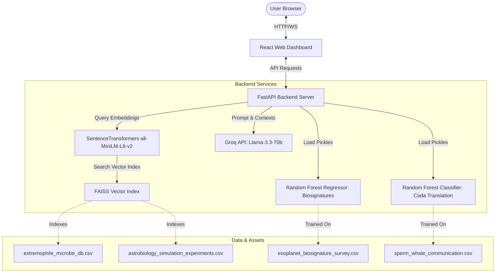

# XenoDecipher & CosmoBio Portal

Welcome to the **XenoDecipher & CosmoBio Portal**, an advanced, premium-themed web application and scientific engine designed for astrobiology and xenolinguistics data analysis, prediction, and semantic search.

This platform bridges the gap between planetary biosignature metrics and marine mammal xenolinguistics proxies using machine learning and Retrieval-Augmented Generation (RAG) models.

---

## 🌌 System Architecture

The project is structured as a decoupled monorepo combining a fast FastAPI server, a beautiful React user interface built using custom Orbitron/Inter fonts and sci-fi glassmorphism themes, and a vector search engine for database queries.



---

## 🚀 Key Features

### 1. 🪐 Biosignatures Predictor (Exoplanets)
*   **Engine**: A regularized Random Forest Regressor trained on the `exoplanet_biosignature_survey.csv` dataset.
*   **Details**: Predicts continuous biosignature confidence levels (0–100%) and provides classifications based on planetary radius ($R_\oplus$), orbital period, surface temperature (K), atmospheric oxygen/methane mixing ratios, biofluorescence signals, habitable zone (HZ) positions, and water vapor detections.

### 2. 🐋 Xenolinguistics Translator (Sperm Whale Codas)
*   **Engine**: A regularized Random Forest Classifier trained on the `sperm_whale_communication.csv` dataset.
*   **Details**: Serves as an acoustic xenolinguistics proxy by classifying codas into behavioral contexts (e.g., socializing, foraging, decentralized coordination) using clicks counts, inter-click intervals (ICI), vocal frequency (Hz), duration (seconds), and matriarch social anchors.
*   **Acoustic Synthesizer**: Features an interactive Web Audio API synthesizer that plays synthesized acoustic clicks based on user parameters, accompanied by visual wave fluctuations.

### 3. 💬 Cosmo-LLM RAG Chat Terminal
*   **Engine**: FAISS (Facebook AI Similarity Search) + SentenceTransformers (`all-MiniLM-L6-v2`) + Groq Cloud (`llama-3.3-70b-versatile`).
*   **Details**: Indexes and queries the `extremophile_microbe_db.csv` (discovery parameters, survival thresholds, analog planets) and `astrobiology_simulation_experiments.csv` (simulation environment tests, target planets, metabolite outcomes, biosignature detectability).
*   **Hybrid Search**: Generates real-time semantic query embeddings. If no Groq API Key is configured, the system falls back to a mock/offline retrieval panel displaying the top semantic context matches from local databases.

### 4. 📊 Analytics Hub
*   **Engine**: Principal Component Analysis (PCA) + Chart.js.
*   **Details**: Projects high-dimensional exoplanet survey parameters down to a 2D PCA scatterplot to visualize distribution clusters and habitable zone groupings. Includes distribution statistics for whale coda vocalizations.

---

## 📂 Repository Layout

```text
├── backend/
│   ├── main.py                  # FastAPI Application Entrypoint
│   ├── train_models.py          # Machine Learning training script (Random Forest)
│   ├── rag_indexer.py           # RAG document parsing & FAISS embedding generation
│   ├── Dockerfile               # Backend Docker configuration
│   ├── .env.example             # Template for API keys
│   └── requirements.txt         # Backend Python packages
│
├── frontend/
│   ├── src/
│   │   ├── App.jsx              # React Main Portal Layout & Views
│   │   ├── main.jsx             # React entrypoint
│   │   ├── index.css            # Sci-fi UI theme, animations & custom sliders
│   │   └── App.css              # Extra components styles
│   ├── public/                  # Public assets
│   ├── Dockerfile               # Nginx build container setup
│   └── package.json             # Frontend packages
│
├── docker-compose.yml           # Unified multi-container orchestration
├── .dockerignore                # Excluded docker files
├── .gitignore                   # Main repository file exclusion configurations
├── requirements.txt             # Root Python requirements link
├── README.md                    # System documentation
│
└── *.csv                        # Analytical CSV Datasets
```

---

## ⚙️ Setup & Installation

### Option 1: Multi-Container Setup with Docker (Recommended)
This launches both the frontend and backend containers in parallel, mounting database references properly.

1.  Make sure you have **Docker** and **Docker Compose** installed.
2.  Start the services:
    ```bash
    docker-compose up --build
    ```
3.  Open your browser:
    *   **Frontend Web App**: `http://localhost:5173`
    *   **FastAPI backend docs**: `http://localhost:8000/docs`

---

### Option 2: Manual Local Setup

#### 1. Backend API Server
Navigate to the `backend/` directory:
```bash
cd backend
```

1.  **Configure environment variables**:
    Copy `.env.example` to `.env` and fill in your Groq API Key (for LLM RAG capabilities):
    ```bash
    cp .env.example .env
    ```
    *(Note: If you leave the key as the default, the chat terminal functions in offline search mode using local database chunks)*

2.  **Create a Virtual Environment**:
    ```bash
    python -m venv .venv
    # On Windows:
    .venv\Scripts\activate
    # On macOS/Linux:
    source .venv/bin/activate
    ```

3.  **Install Dependencies**:
    ```bash
    pip install torch --extra-index-url https://download.pytorch.org/whl/cpu
    pip install -r requirements.txt
    ```

4.  **Process RAG Index**:
    Parse the CSV files and index them into the FAISS vector store:
    ```bash
    python rag_indexer.py
    ```

5.  **Train Predictor Models**:
    Train the machine learning classifiers/regressors and save the pickled models:
    ```bash
    python train_models.py
    ```

6.  **Run FastAPI**:
    ```bash
    uvicorn main:app --reload
    ```

#### 2. Frontend Development Server
Navigate to the `frontend/` directory:
```bash
cd ../frontend
```

1.  **Install Node packages**:
    ```bash
    npm install
    ```

2.  **Run Vite Development server**:
    ```bash
    npm run dev
    ```
3.  Open the local address printed on your terminal (usually `http://localhost:5173`).

---

## 📡 Core API Endpoints

| Endpoint | Method | Request Payload / Params | Description |
| :--- | :--- | :--- | :--- |
| `/api/health` | `GET` | *None* | Verifies database/model availability and system status. |
| `/api/predict-biosignature` | `POST` | `BiosignatureInput` JSON | Predicts the biosignature confidence score percentage. |
| `/api/translate-coda` | `POST` | `CodaInput` JSON | Classifies whale coda parameters into behavioral contexts. |
| `/api/cosmo-chat` | `POST` | `ChatInput` JSON | Performs RAG vector search + Groq Llama-3.3 chat. |
| `/api/dataset-stats` | `GET` | *None* | Returns dataset statistics, sample records, and 2D PCA exoplanet plot data. |

---

## 🛠️ Built With
*   **Frontend**: React, Vite, Chart.js, Lucide Icons, Vanilla CSS (with responsive custom glassmorphism components).
*   **Backend**: FastAPI, Uvicorn, Python, PyTorch.
*   **AI & ML**: Scikit-Learn (Random Forest), FAISS (CPU), SentenceTransformers (`all-MiniLM-L6-v2`), Groq API (`llama-3.3-70b-versatile`).
*   **Infrastructure**: Docker, Nginx, Docker Compose.

## Biosignatures


## Xenolinguistics


## Cosmo LLM-RAG


## Analytics Hub


## Data Source
https://on.natgeo.com/BRWA61426

---